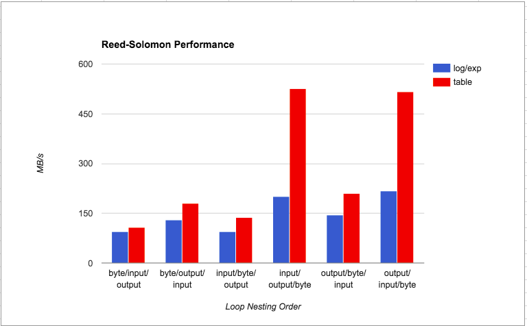

# JavaReedSolomon

This is a simple and efficient Reed-Solomon implementation in Java, which
was originally built at Backblaze.  There is an overview of how the
algorithm works in my [blog post](https://www.backblaze.com/blog/reed-solomon/).

The ReedSolomon class does the encoding and decoding, and is supported
by Matrix, which does matrix arithmetic, and Galois, which is a finite
field over 8-bit values.

For examples of how to use ReedSolomon, take a look at SampleEncoder
and SampleDecoder.  They show, in a very simple way, how to break a
file into shards and encode parity, and then how to take a subset of
the shards and reconstruct the original file.

There is a Gradle build file to make a jar and run the tests.  Running
it is simple.  Just type: `gradle build`

We would like to send out a special thanks to James Plank at the
University of Tennessee at Knoxville for his useful papers on erasure
coding.  If you'd like an intro into how it all works, take a look at
[this introductory paper](http://web.eecs.utk.edu/~plank/plank/papers/SPE-9-97.html).

This project is limited to a pure Java implementation.  If you need
more speed, and can handle some assembly-language programming,
you may be interested in using the Intel SIMD instructions to speed
up the Galois field multiplication.  You can read more about that 
in the paper on [Screaming Fast Galois Field Arithmetic](http://www.kaymgee.com/Kevin_Greenan/Publications_files/plank-fast2013.pdf).

## Performance Notes

The performance of the inner loop depends on the specefic processor
you're running on.  There are twelve different permutations of the
loop in this library, and the ReedSolomonBenchmark class will tell
you which one is faster for your particular application.  The number
of parity and data shards in the benchmark, as well as the buffer
sizes, match the usage at Backblaze.  You can set the parameters of
the benchmark to match your specific use before choosing a loop
implementation. 

These are the speeds I got running the benchmark on a Backblaze
storage pod:

```
    ByteInputOutputExpCodingLoop         95.2 MB/s
    ByteInputOutputTableCodingLoop      107.0 MB/s
    ByteOutputInputExpCodingLoop        130.3 MB/s
    ByteOutputInputTableCodingLoop      181.4 MB/s
    InputByteOutputExpCodingLoop         94.4 MB/s
    InputByteOutputTableCodingLoop      138.3 MB/s
    InputOutputByteExpCodingLoop        200.4 MB/s
    InputOutputByteTableCodingLoop      525.7 MB/s
    OutputByteInputExpCodingLoop        143.7 MB/s
    OutputByteInputTableCodingLoop      209.5 MB/s
    OutputInputByteExpCodingLoop        217.6 MB/s
    OutputInputByteTableCodingLoop      515.7 MB/s
```


